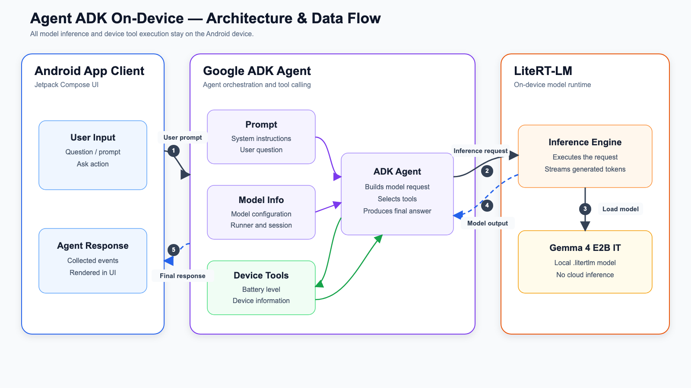

# Mobile AI Agent with Google ADK & On-Device Model Inference

## About

This Android app showcases agentic AI running entirely on a mobile device, without cloud-based model inference. It combines the Kotlin-based Google ADK agentic framework with the LiteRT-LM runtime to run an on-device language model.

## App Demo

[▶ Play the app demo](screen-capture/app-demo.mp4)

## Technology

- Agentic framework: [Google ADK](https://developer.android.com/ai/adk)
- Model runtime: [LiteRT-LM](https://developers.google.com/edge/litert-lm/android)
- Model used in this example: [gemma-4-E2B-it-litert-lm](https://huggingface.co/litert-community/gemma-4-E2B-it-litert-lm)

This project is a simplified adaptation of the [Google ADK Kotlin example](https://github.com/google/adk-kotlin).

## Features

1. Loads LiteRT-LM models from local device storage.
2. Supports tool calling for device information.
3. Simple Google ADK agent.
4. Runs model inference fully offline, with no internet connection required.

## Architecture



## Build and run in Android

Set up a local model: 

1. Download a LiteRT-LM model from Hugging Face.
2. Save the model anywhere accessible through your device's file manager or shared storage.
3. Update `MODEL_PATH` in `MainActivity.kt` to match the model's location. The current example expects:

   ```text
   /sdcard/LLM/gemma-4-E2B-it.litertlm
   ```

4. Build and run the app. Grant **All files access** when Android asks for storage permission.

You can try other on-device models that suit your device's memory and performance capabilities from the [LiteRT Community repository](https://huggingface.co/litert-community/).
